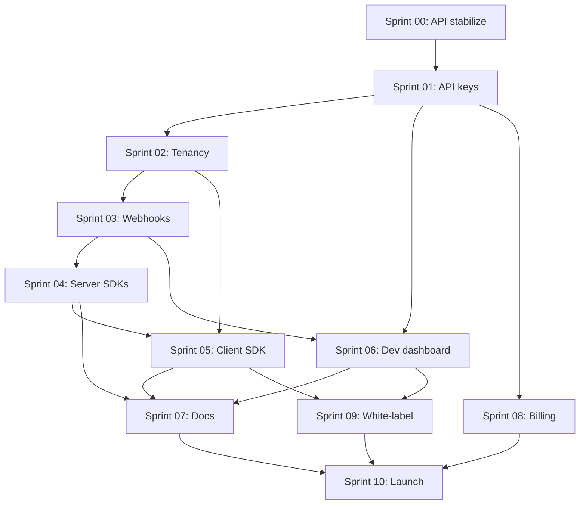

# Sprint Roadmap — Developer Platform Conversion

## Overview

| Sprint | Name | Duration | Depends on | Milestone |
|--------|------|----------|------------|-----------|
| [00](./sprints/sprint-00-audit-and-api-stabilization.md) | Audit & API stabilization | 2 wk | — | API contract frozen |
| [01](./sprints/sprint-01-developer-identity-and-api-keys.md) | Developer identity & API keys | 2 wk | 00 | Keys work on API |
| [02](./sprints/sprint-02-tenant-isolation-and-scopes.md) | Tenant isolation & scopes | 2 wk | 01 | Project-scoped streams |
| [03](./sprints/sprint-03-webhooks-and-events.md) | Webhooks & events | 2 wk | 02 | Events delivered |
| [04](./sprints/sprint-04-server-sdks.md) | Server SDKs | 3 wk | 03 | npm + Go SDK shipped |
| [05](./sprints/sprint-05-client-sdk-and-embeddables.md) | Client SDK & embeddables | 3 wk | 02, 04 | React room embed works |
| [06](./sprints/sprint-06-developer-dashboard.md) | Developer dashboard | 2 wk | 01, 03 | Keys & webhooks in UI |
| [07](./sprints/sprint-07-documentation-and-sandbox.md) | Docs & sandbox | 2 wk | 04, 05, 06 | Public quickstart |
| [08](./sprints/sprint-08-metering-and-developer-billing.md) | Metering & dev billing | 2 wk | 01 | Usage per project |
| [09](./sprints/sprint-09-white-label-and-customization.md) | White-label | 2 wk | 05, 06 | Custom branding |
| [10](./sprints/sprint-10-production-hardening-and-launch.md) | Hardening & launch | 2 wk | All | GA release |

**Total:** ~24 weeks (1 staff + 1–2 engineers)

---

## Dependency graph



---

## Parallelization opportunities

| Can run in parallel | Condition |
|---------------------|-----------|
| Sprint 06 + Sprint 04 | Different engineers; dashboard mocks API until 04 ships |
| Sprint 08 + Sprint 05 | Billing schema vs frontend SDK |
| Sprint 09 + Sprint 07 | White-label theming vs docs writing |

**Serial critical path:** 00 → 01 → 02 → 03 → 04 → 07 → 10

---

## Milestone demos

### M1 — "Hello API" (end of Sprint 02)

```bash
curl -H "Authorization: Bearer sk_test_..." \
  https://api.talkietalker.stream/api/v1/streams \
  -d '{"title":"Test","mode":"room","visibility":"private"}'
```

### M2 — "Hello webhook" (end of Sprint 03)

Integrator receives `stream.started` at their endpoint within 5 seconds.

### M3 — "Hello embed" (end of Sprint 05)

```tsx
<TalkieTalkerRoom roomId="..." token={embedToken} />
```

### M4 — "Hello launch" (end of Sprint 10)

Design partner runs production traffic with SLA monitoring.

---

## Sprint ceremony template

Each sprint file includes:

- **Goal** — one sentence
- **Tasks** — numbered with owner, estimate, acceptance criteria
- **Implementation prompt** — paste into AI pairing
- **Files likely touched**
- **Demo script** — how to verify
- **Retro questions**

### Sprint kickoff checklist

- [ ] Read previous sprint retro notes
- [ ] Confirm dependencies merged to `main`
- [ ] Create tracking epic / milestone in issue tracker
- [ ] Assign tasks
- [ ] Update `talkietalker-stream-docs` changelog stub

### Sprint close checklist

- [ ] All acceptance criteria met or explicitly deferred
- [ ] OpenAPI updated and SDK regen (if applicable)
- [ ] Integration tests green in CI
- [ ] Demo recorded for stakeholders
- [ ] Next sprint file reviewed by tech lead

---

## Effort estimates (story points)

| Sprint | Points | Notes |
|--------|--------|-------|
| 00 | 13 | Mostly analysis + small fixes |
| 01 | 21 | New auth middleware + migrations |
| 02 | 21 | Touch many repos/queries |
| 03 | 21 | Webhook worker complexity |
| 04 | 34 | Three SDKs + CI |
| 05 | 34 | Largest frontend extraction |
| 06 | 21 | Dashboard pages |
| 07 | 13 | Docs + sandbox config |
| 08 | 21 | Billing extension |
| 09 | 13 | Theming + config |
| 10 | 21 | Load test, runbooks, launch |

**Total ~233 points** (~6 months at 20 pts/sprint for a team of 2)

---

## Deferred (post-GA backlog)

| Item | Reason |
|------|--------|
| Mobile SDKs (Swift, Kotlin) | Validate React embed first |
| WHIP ingest endpoint | See `streaming-platform-prompt.md` |
| GraphQL API | REST sufficient for v1 |
| Multi-region SFU | Single region at launch |
| OAuth apps (3-legged) | API keys sufficient for v1 |
| Marketplace / app directory | Needs ecosystem scale |

---

## Start here

→ [Sprint 00: Audit & API stabilization](./sprints/sprint-00-audit-and-api-stabilization.md)
