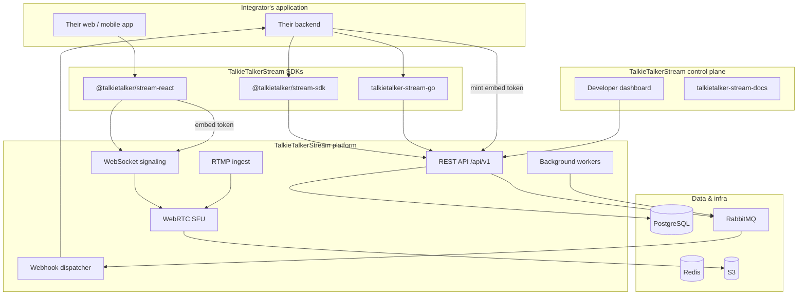
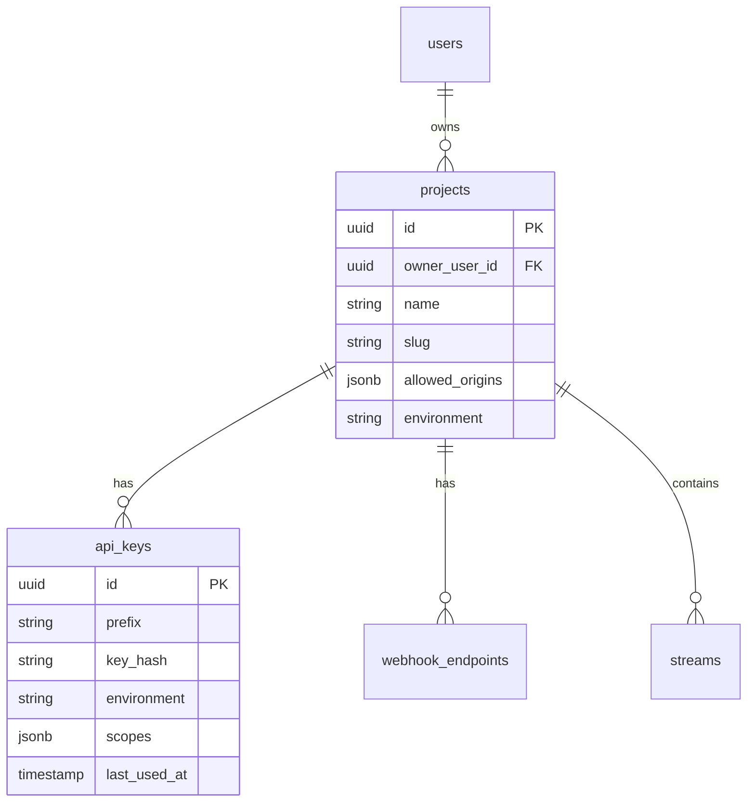
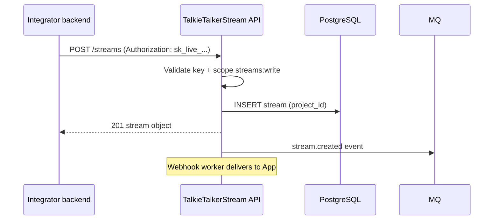
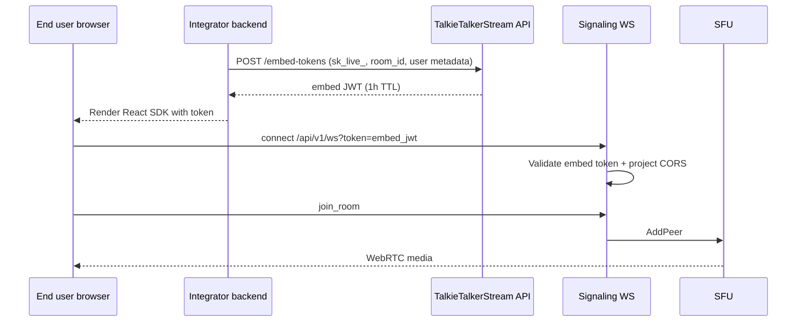
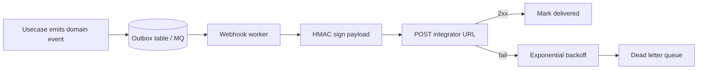
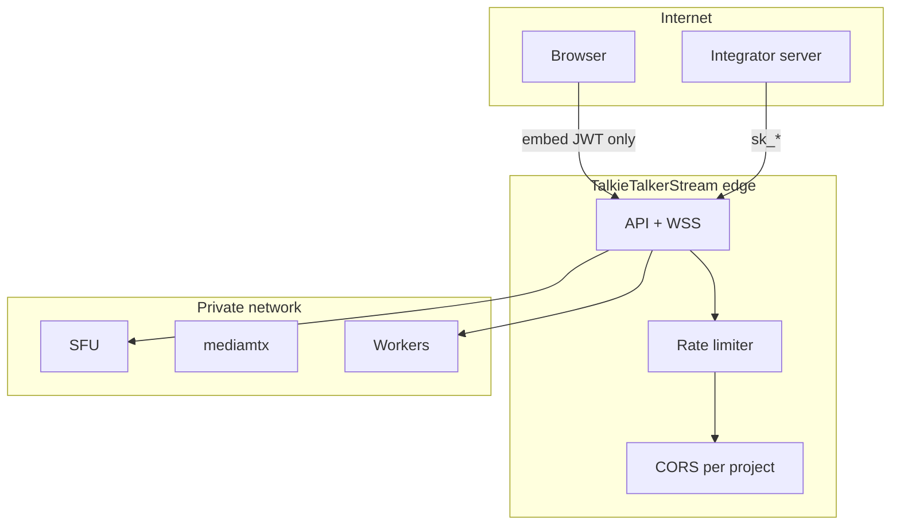

# Target Architecture — TalkieTalkerStream Developer Platform

## High-level system diagram



---

## Identity & tenancy model



### Principal types

| Principal | Header / credential | Used by |
|-----------|---------------------|---------|
| `UserPrincipal` | Cookie / `Bearer` JWT | Dashboard, talkietalker-stream-web |
| `APIKeyPrincipal` | `Authorization: Bearer sk_live_...` | Server SDKs, CI |
| `EmbedPrincipal` | `Bearer` embed JWT or query `?token=` | Browser SDK, iframe |
| `ServicePrincipal` | `X-Service-Token` | mediamtx, internal |

### Scope examples

```
streams:read          streams:write         streams:delete
rooms:create          rooms:join            rooms:moderate
recordings:read       webhooks:manage       billing:read
chat:read             chat:write            access:grant
```

---

## Request flow: server integration



---

## Request flow: browser embed



**Critical:** `sk_live_` never touches the browser.

---

## Webhook architecture



### Webhook payload shape

```json
{
  "id": "evt_01H...",
  "type": "stream.started",
  "created_at": "2026-06-29T12:00:00Z",
  "project_id": "proj_...",
  "data": {
    "object": "stream",
    "id": "str_...",
    "status": "live"
  }
}
```

Headers:

```
X-TalkieTalkerStream-Signature: t=...,v1=...
X-TalkieTalkerStream-Event-Id: evt_01H...
```

---

## Package layout (target)

```
stream/                          # monorepo root
├── talkietalker-stream-backend/              # unchanged core + new handlers
├── talkietalker-stream-web/                  # dashboard + dogfooding
├── talkietalker-stream-docs/                 # + content/developers/
├── packages/                    # NEW
│   ├── talkietalker-stream-node/           # @talkietalker/stream-sdk + @talkietalker/stream-react
│   ├── talkietalker-stream-go/           # Go SDK module
│   └── streamflow-python/       # optional Sprint 04+
├── examples/                    # NEW
│   ├── node-quickstart/
│   ├── react-embed-room/
│   └── webhook-receiver/
└── dev-platform/                # these guides
```

---

## API versioning strategy

| Version | Policy |
|---------|--------|
| `v1` (current) | Maintain backward compatibility; additive changes only |
| `v1.1` | Standardized error envelope + `request_id` (optional header) |
| `v2` | Breaking changes only if unavoidable; 12-month deprecation |

New developer resources use consistent object prefixes:

| Object | ID prefix |
|--------|-----------|
| Project | `proj_` |
| API key | `key_` (secret: `sk_live_`, `sk_test_`) |
| Stream | `str_` (or keep UUID) |
| Webhook endpoint | `wh_` |
| Event | `evt_` |

---

## Sandbox vs production

| Dimension | Sandbox (`sk_test_`) | Production (`sk_live_`) |
|-----------|----------------------|-------------------------|
| Data isolation | Logical (`project.environment`) | Logical |
| Rate limits | 100 req/min | Plan-based |
| Webhook delivery | Real HTTP, flagged `livemode: false` | Real HTTP |
| SFU / media | Shared infra, max 10 viewers/room | Full limits |
| Billing | No charge | Metered |

---

## Security boundaries



---

## Observability (Sprint 10)

| Signal | Labels |
|--------|--------|
| API latency histogram | `project_id`, `route`, `status` |
| Webhook delivery | `endpoint_id`, `event_type`, `attempt` |
| SFU sessions | `project_id`, `mode` |
| API key usage | `key_id` (hashed), `scope` |

Expose **request logs** in developer dashboard (last 7 days, sandbox + production).

---

## Migration path for existing users

Existing `users` and `streams` without `project_id`:

1. Sprint 02 migration creates default project per user: `"Default project"`
2. Backfill `streams.project_id` from `streams.user_id`
3. Dashboard continues via JWT → implicit default project
4. Integrators create explicit projects + keys

No breaking change for current SaaS users.
