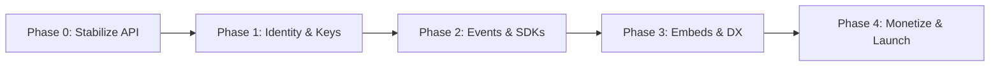

# Transformation Strategy — SaaS to Developer Platform

## Executive summary

TalkieTalkerStream today is a **vertical SaaS**: creators and teams sign up, use the dashboard, and stream. The codebase is already **API-driven** (REST + WebSocket + workers), but identity, docs, and UX assume a **single tenant per user**.

The conversion reframes TalkieTalkerStream as **infrastructure**:

| Today (SaaS) | Target (Developer platform) |
|--------------|----------------------------|
| User logs into dashboard | Developer's users never see TalkieTalkerStream branding (optional) |
| JWT session for everything | API keys (server) + embed tokens (browser) |
| Features in `talkietalker-stream-web` | Features in SDKs + embeddables |
| Docs explain product | Docs explain integration |
| Billing per streamer usage | Billing per project + API/viewer metering |
| Support via UI | Support via logs, webhooks, status page |

**The dashboard becomes a control plane**, not the product surface.

---

## Why now

The hard problems are **already solved**:

1. WebRTC SFU with room governance (waiting room, roles, recording)
2. RTMP ingest + multistream + VOD pipeline
3. Pay-gating and fan subscriptions
4. Real-time chat with moderation
5. Usage-based billing primitives

What's missing is the **integration layer** — the packaging that lets others consume these capabilities without forking the monolith.

---

## Product positioning

### Primary customers (post-conversion)

| Segment | Integration pattern | Revenue |
|---------|---------------------|---------|
| B2B SaaS | Embed rooms in their app | Per-seat or per-minute |
| Ed-tech / telehealth | iframe + server SDK | Enterprise contracts |
| Creator tools | Broadcast API + multistream | Usage-based |
| Agencies | White-label + API | Platform fee |

### Secondary customers (retained)

- Individual creators using the first-party dashboard (dogfooding, onboarding funnel)

---

## Conversion phases (maps to sprints)



| Phase | Sprints | Outcome |
|-------|---------|---------|
| **0 — Foundation** | 00 | Contract-stable API, error codes, rate limit design |
| **1 — Identity** | 01–02 | Projects, API keys, scopes, tenant isolation |
| **2 — Integration** | 03–05 | Webhooks, server SDKs, client SDK + embeds |
| **3 — Experience** | 06–07 | Developer dashboard, sandbox, docs |
| **4 — Scale** | 08–10 | API billing, white-label, production launch |

---

## What we keep vs. change

### Keep (no rewrite)

| Component | Reason |
|-----------|--------|
| SFU (`internal/sfu/`) | Core IP, battle-tested |
| Signaling protocol | Frontend already implements; document + stabilize |
| Postgres schema (extend) | Add tables, don't migrate streams |
| RabbitMQ workers | Webhook delivery fits naturally |
| `talkietalker-stream-docs` | Extend Developer Reference |
| First-party dashboard | Reference app + admin |

### Change (incremental)

| Component | Change |
|-----------|--------|
| Auth middleware | Support API keys alongside JWT |
| Stream/room creation | Accept `project_id`, validate key scope |
| CORS | Per-project allowlist |
| OpenAPI | Add Projects, Keys, Webhooks, Embed tokens |
| `talkietalker-stream-web` | Add `/dashboard/developer/*` section |
| Billing | New metric types for API usage |

### Add (net new)

| Component | Sprint |
|-----------|--------|
| `projects`, `api_keys`, `webhook_endpoints` tables | 01–03 |
| Webhook delivery worker | 03 |
| `packages/talkietalker-stream-node`, `talkietalker-stream-go` | 04–05 |
| Sandbox environment | 07 |
| Embed token minting endpoint | 02 |

---

## Dual-mode operation

During conversion, both modes run in parallel:

```
┌─────────────────────────────────────────────────────────┐
│                    talkietalker-stream-backend                        │
│  ┌──────────────┐    ┌──────────────────────────────┐ │
│  │ JWT auth     │    │ API key auth                  │ │
│  │ (dashboard)  │    │ (integrations)                │ │
│  └──────┬───────┘    └──────────────┬───────────────┘ │
│         │                           │                  │
│         └───────────┬───────────────┘                  │
│                     ▼                                  │
│              usecase layer (shared)                    │
└─────────────────────────────────────────────────────────┘
```

**Rule:** Business logic lives in usecases. Auth is a pluggable principal (`UserPrincipal` | `APIKeyPrincipal`).

---

## Risk register

| Risk | Mitigation | Sprint |
|------|------------|--------|
| Breaking existing dashboard | JWT path unchanged; integration tests on both auth modes | 01 |
| API key leakage | Never in browser; rotate + audit log | 01 |
| Webhook abuse (SSRF) | URL allowlist, no private IPs in sandbox | 03 |
| SDK drift from API | Generate from OpenAPI CI check | 04 |
| SFU overload from embeds | Per-project rate limits + viewer caps | 08 |
| Scope creep | Sprint files are scope contracts | All |

---

## Metrics (track weekly)

| Metric | Target at launch |
|--------|------------------|
| Time to first API call (sandbox) | &lt; 5 min |
| Time to embedded room | &lt; 30 min |
| OpenAPI coverage | 100% public endpoints |
| Webhook delivery success | &gt; 99.5% (24h) |
| SDK test coverage | &gt; 80% critical paths |
| Docs NPS (developer survey) | &gt; 40 |

---

## Team roles (recommended)

| Role | Ownership |
|------|-----------|
| Staff engineer | Architecture, auth model, SDK design |
| Backend engineer | Migrations, handlers, webhook worker |
| Frontend engineer | Developer dashboard, SDK extraction |
| DevRel / technical writer | talkietalker-stream-docs developers section |
| PM | Pricing, sandbox limits, launch GTM |

---

## Go-to-market (developer launch)

1. **Private beta** — 5 design partners (Sprint 06–07)
2. **Public beta** — Sandbox keys, rate-limited (Sprint 08)
3. **GA** — Production keys, SLA, status page (Sprint 10)

Launch assets:

- "Add video meetings to your app in 15 minutes" quickstart
- React + Node example repo (`examples/stream-react-meet/`)
- Comparison page: TalkieTalkerStream vs LiveKit vs raw WebRTC

---

## Next step

Open [SPRINT-ROADMAP.md](./SPRINT-ROADMAP.md) and begin **Sprint 00**.
